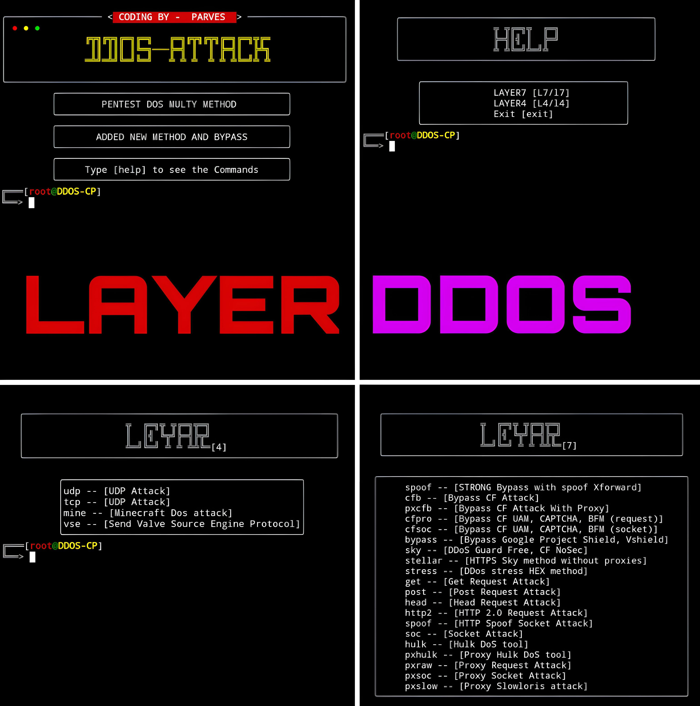

# 7 LAYER DDOS

`DDOS` is a utility tool designed to penetrate any website to stop it's working ability. Here 7Layer method uses multiple users tp request to the target website until it loses it's working limit.

## Features

- MULTIPLE METHODS ARE ADDED
- MOST POWERFUL HULK METHOD
- GET,POST AND SO ON....
## Requirements

- **Termux** - Ensure you have Termux installed on your Android device.
- **Android 7.0+** - Some features may require a modern version of Android.

## Installation

1. Update your Termux packages:
   ```bash
   apt update
   apt upgrade
   pkg install git
   pkg install python
   git clone --depth=1 https://github.com/JOY-XII/Ddos.git
   pip install --no-cache-dir cloudscraper
   pip install setuptools
   pip install requests
   pip install httpx
   pip install undetected_chromedriver
   pip install socket
   cd Ddos
   python DDOS-L7.py
   ```
 2. Short for second time:
 3. ````bash
    rm -rf Ddos
    git clone --depth=1 https://github.com/JOY-XII/Ddos.git
    cd Ddos
    python DDOS-L7.py
    ````
## Tool outlook 

